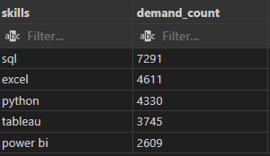

# Introduction
My SQL project which I tackled during my downtime 😵, exploring the data job market with a focus on data analyst roles, 💰 top-paying jobs, 🔥 in-demand skills, and 📈 the connection between high demand and high salary in data analytics. 

🔍 SQL queries here: [ project_sql_1 folder](/project_sql_1/)

# Background
The data for this analysis is from Luke Barousse's SQL Course [SQL Course](http://lukebarousse.com/sql). This data includes details on job titles, salaries, locations, and required skills.

**The questions I wanted to answer through my SQL queries were:**
1) What are the top-paying data analyst jobs?
2) What skills are required for these top-paying jobs?
3) What skills are the most in demand for data analysts?
4) Which skills are associated with higher salaries?
5) What are the most optimal skills to learn?

# Tools I used
- **SQL (Structured Query Language):** to query the database, extract valuable insights to answer key questions in my analysis.
- **PostgreSQL:** to store, query, and manipulate the job posting data.
- **VSCode (Visual Studio Code):** to manage the database and execute SQL queries effectively. 
- **Git/Github:** Essential for version control, sharing SQL scripts/analysis, ensuring collaboration and project tracking. 

# The Analysis
Each query for this project aimed at investigating specific aspects of the data analyst job market. Here's how I approached each question:

## 1. Top Paying Data Analyst Jobs: 
I narrowed down data analyst roles based on average salary and location, emphasizing remote jobs to highlight the top-paying opportunites in the field.

```sql
SELECT
	job_id,
	job_title,
	job_location,
	job_schedule_type,
	salary_year_avg,
	job_posted_date,
	name AS company_name
FROM
	job_postings_fact
LEFT JOIN company_dim ON job_postings_fact.company_id = company_dim.company_id
-- add company name from company dim table 
WHERE
	job_title_short= 'Data Analyst'
	AND salary_year_avg IS NOT NULL
	AND job_location = 'Anywhere'
ORDER BY
	salary_year_avg DESC 
LIMIT 10;
```
Here's the breakdown of the top data analyst jobs in 2023:
- **High Salary Potential:** Data analyst roles can command salaries ranging from $184K to $650K, showcasing substantial earning opportunities in the field.
- **Wide Range of Employers:** Major companies like SmartAsset, Meta, and AT&T offer competitive salaries, highlighting the demand for data analysts across various industries.
- **Variety of Roles:** The field includes a broad spectrum of job titles, from Data Analysts to Director of Analytics, reflecting diverse roles and specializations within data analytics. 


*Bar graph generated by ChatGPT, visualizing the salary for the top 10 salaries for Data Analysts*

## 2. Skills for Top Paying Jobs:
To identify the key skills employers seek for top-paying jobs, I combined job postings with skills data.

```sql
WITH top_paying_jobs AS (
    SELECT
        job_id,
        job_title,
        salary_year_avg,
        name AS company_name
    FROM
        job_postings_fact
    LEFT JOIN company_dim ON job_postings_fact.company_id = company_dim.company_id
    WHERE
        job_title_short= 'Data Analyst'
        AND salary_year_avg IS NOT NULL
        AND job_location = 'Anywhere'
    ORDER BY
        salary_year_avg DESC 
    LIMIT 10
) 

SELECT 
    top_paying_jobs.*,
    skills
FROM top_paying_jobs
INNER JOIN skills_job_dim ON top_paying_jobs.job_id = skills_job_dim.job_id
INNER JOIN skills_dim ON skills_job_dim.skill_id = skills_dim.skill_id
ORDER BY
    salary_year_avg DESC;
```
Most Common Skills:
- **SQL** is the most frequently listed skill, appearing 8 times.
- **Python** follows closely, mentioned in 7 postings.
- **Tableau** is another high-demand skill, listed 6 times.

Other Frequently Mentioned Skills:
- **R:** 4 mentions
- **Snowflake, Pandas, and Excel:** 3 mentions each
- **Other tools** and technologies, like **Confluence, AWS, and Power BI**, are mentioned twice.


*Bar graph generated by ChatGPT, visualizing the count of skills for the top 10 paying jobs for Data Analysts*

## 3. In-Demand Skills for Data Analysts:
This query helped determine the skills most frequently resquested in job postings, directing focus to areas with high demand.

```sql
SELECT 
    skills,
    COUNT(skills_job_dim.job_id) AS demand_count -- aggregation, so needs GROUP BY...
FROM job_postings_fact
INNER JOIN skills_job_dim ON job_postings_fact.job_id = skills_job_dim.job_id
INNER JOIN skills_dim ON skills_job_dim.skill_id = skills_dim.skill_id
WHERE 
    job_postings_fact.job_title_short = 'Data Analyst'
    AND job_work_from_home = TRUE
GROUP BY        
    skills
ORDER BY    
    demand_count DESC         
LIMIT 5;
```
- **SQL** and **Excel** are essential, highlighting the importance of foundational data processing and spreadsheet abilities.
- **Programming** and **Viz Tools** like **Python, Tableau,** and **PowerBI** are also crucial for data analysis and viz in data storytelling and decision-making. 



*Table of the demand for the top 5 skills in Data Analyst job postings.*

## 4. Skills Based on Salary:
Exploring the average salaries associated with different skills revealed which skills are the highest paying.

```sql
SELECT 
    skills,
    ROUND (AVG(salary_year_avg), 0) AS avg_salary
    -- COUNT(skills_job_dim.job_id) AS demand_count -- aggregation, so needs GROUP BY...
FROM job_postings_fact
INNER JOIN skills_job_dim ON job_postings_fact.job_id = skills_job_dim.job_id
INNER JOIN skills_dim ON skills_job_dim.skill_id = skills_dim.skill_id
WHERE 
    job_postings_fact.job_title_short = 'Data Analyst'
    AND salary_year_avg IS NOT NULL
    AND job_work_from_home = TRUE
GROUP BY        
    skills
ORDER BY    
    -- demand_count DESC
    avg_salary DESC     
LIMIT 25;
```
Insights on Top-Paying Skills for Data Analysts:
- **High-Tech Tools Lead:** Advanced tools like PySpark, Bitbucket, and Couchbase command the highest salaries, reflecting demand for expertise in cutting-edge and cloud-based technologies.

- **Specialized Skills Pay Well:** Niche skills such as DataRobot, Watson, and Jupyter are associated with salaries above $150,000, highlighting the premium on AI, automation, and data science platforms.

- **Emerging Tech Demand:**  Skills like Databricks, Kubernetes, and Airflow indicate a focus on scalable data management, orchestration, and modern infrastructure in top-paying roles.


*Table of the average salary for the top 10 paying skills for Data Analysts.*

## 5. Most Optimal Skills to Learn:
This query identified high-demand, high-salary skills by combining demand and salary data, guiding strategic skill development. 

```sql
WITH skills_demand AS (
    SELECT 
        skills_dim.skill_id,
        skills_dim.skills,
        COUNT(skills_job_dim.job_id) AS demand_count -- aggregation, so needs GROUP BY...
    FROM job_postings_fact
    INNER JOIN skills_job_dim ON job_postings_fact.job_id = skills_job_dim.job_id
    INNER JOIN skills_dim ON skills_job_dim.skill_id = skills_dim.skill_id
    WHERE 
        job_postings_fact.job_title_short = 'Data Analyst'
        AND job_work_from_home = TRUE
        AND salary_year_avg IS NOT NULL
    GROUP BY        
        skills_dim.skill_id           
), -- HERE is when combined 2 CTEs
average_salary AS (
    SELECT 
        skills_job_dim.skill_id,
        ROUND (AVG(salary_year_avg), 0) AS avg_salary
        -- COUNT(skills_job_dim.job_id) AS demand_count -- aggregation, so needs GROUP BY...
    FROM job_postings_fact
    INNER JOIN skills_job_dim ON job_postings_fact.job_id = skills_job_dim.job_id
    INNER JOIN skills_dim ON skills_job_dim.skill_id = skills_dim.skill_id
    WHERE 
        job_postings_fact.job_title_short = 'Data Analyst'
        AND salary_year_avg IS NOT NULL
        AND job_work_from_home = TRUE
    GROUP BY        
        skills_job_dim.skill_id       
)    
-- SOS: My brain cells are dead at this point hahahahahahahaha
SELECT
    skills_demand.skill_id,
    skills_demand.skills,
    demand_count,
    avg_salary
FROM 
    skills_demand    
INNER JOIN average_salary ON skills_demand.skill_id = average_salary.skill_id
WHERE   
    demand_count > 10
ORDER BY
    avg_salary DESC,
    demand_count DESC
LIMIT 25;
```

REWRITE this query above in a 'cleaner' version:
```sql
SELECT  
    skills_dim.skill_id,
    skills_dim.skills,
    COUNT(skills_job_dim.job_id) AS demand_count,
    ROUND(AVG(job_postings_fact.salary_year_avg), 0) AS avg_salary
FROM
    job_postings_fact
INNER JOIN skills_job_dim ON job_postings_fact.job_id = skills_job_dim.job_id
INNER JOIN skills_dim ON skills_job_dim.skill_id = skills_dim.skill_id
WHERE   
    job_title_short = 'Data Analyst'
    AND salary_year_avg IS NOT NULL
    AND job_work_from_home = TRUE
GROUP BY    
    skills_dim.skill_id
HAVING
    COUNT(skills_job_dim.job_id) > 10
ORDER BY        
    avg_salary DESC,
    demand_count DESC
LIMIT 25; 
```
- **High-Demand Programming Languages:** Python and R are in high demand (236 and 148 counts, respectively), with avg salaries of around $101K and $100K, showing not only their value but also wide availability in the job market.
- **Cloud Tools and Technologies:** Snowflake, Azure, AWS, and BigQuery are in high demand, offering strong salaries, reflecting the increasing importance of cloud and bigdata tech in data field. 
- **Business Intelligence and Visualization Tools:** Tableau and Looker are in high demand with avg salaries of $99K and $103K, emphasizing the importance of data viz and Business Intelligence in extracting actionable insights. 
- **Database Technologies:** Skills in traditional and NoSQL databases (Oracle, SQL Server, NoSQL) are in demand, with salaries ranging from $97K to $104K, hihglighting the ongoing need for data storage and management expertise.


*Table of the most optimal skills for Data Analysts sorted by salary.*

# What I learned
- **🧩 Complex Query Crafting:** Mastered advanced SQL, merging tables and using WITH clauses for efficient temp table handling.
- **📊 Data Aggregation:** Familiar with GROUP BY and used COUNT() and AVG() for data summarization.
- **💡 Analytical Wizardry:** Enhanced problem-solving skills by turning questions into actionable SQL queries.

# Conclusions
## Insights
From the analysis, several general insights emerged:
### 1. **Top-paying Data Analyst Jobs:** 
Top remote data analyst jobs offer salaries up to **$650K.**
### 2. **Skills for Top-Paying Jobs:** 
High-paying data analyst jobs require **advanced SQL** proficiency for top salaries.
### 3. **Most In-Demand Skills:** 
**SQL** is the most high-demand skill for data analyst job seekers.
### 4. **Skills with Higher Salaries:** 
Specialized skills like **SVN and Solidity** command the highest average salaries, reflecting the value of niche expertise.
### 5. **Optimal Skills for Job Market Value:**
**SQL** is in high demand with a strong salary, making it key for data analysts to maximize market value. 

## Closing Thoughts:
Right now is 10:47 pm on a frigid Saturday night, Nov 30/2024. I'm drained at this point, things I'm craving for are: 😪☕🍜🍙🍫🥤... And I think I might take a few days off from SQL 🤯💥💣 
Last but not least, for those who made this far, thank you very much! Wishing you a merry Christmas 🎄 and a blissful New Year 2025 ✨


